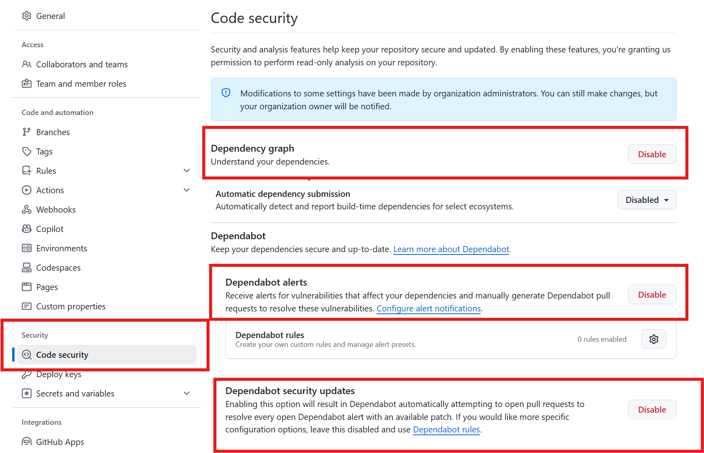
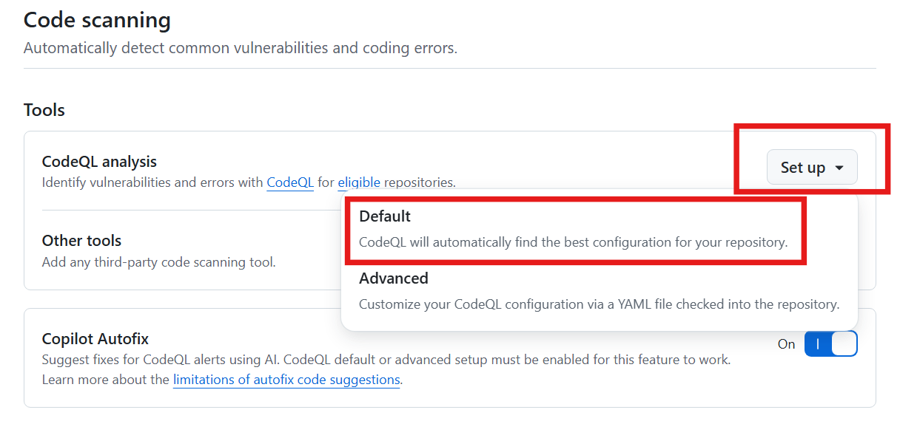
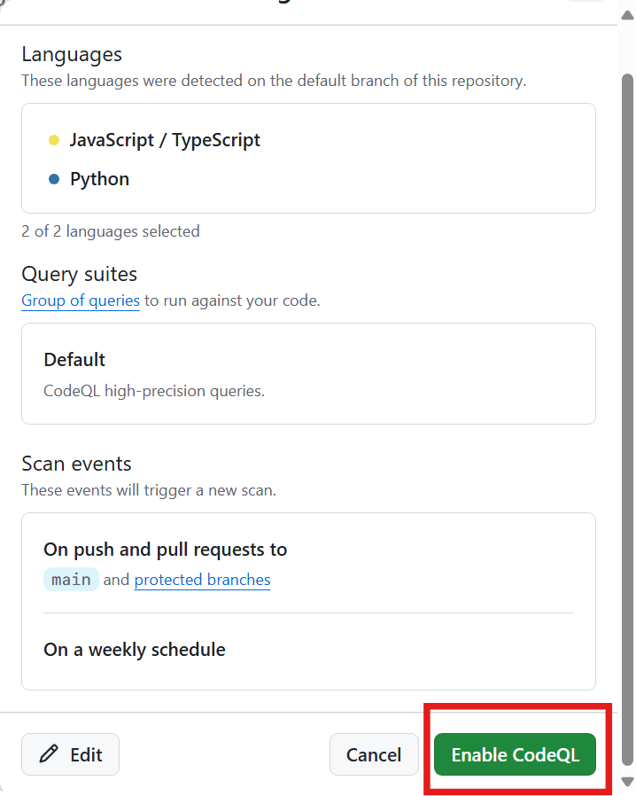
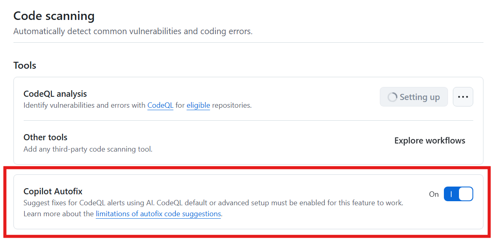
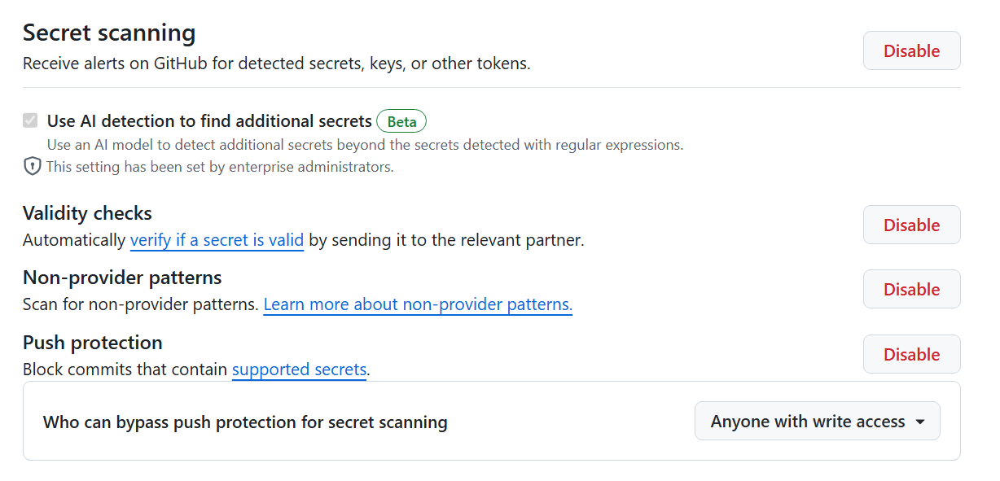

# Lab 1 - GitHub Advanced Security Feature Introduction

Welcome! In this lab, you will be introduced to GitHub Advanced Security (GHAS) and its features. You will use the Juice Shop sample repository to enable the GHAS features, manage alerts, and learn how GitHub Advanced Security can keep vulnerabilities out of your code in the first place.

This lab covers parts of the following exam domains:

- Domain 2: Configure and use secret scanning
- Domain 3: Configure and use dependency management
- Domain 4: Configure and use code scanning

> [!TIP]
> We recommend opening up two browser windows, one with the lab and one with the working copy of your repo!

## Enabling the security settings

In the following exercises, you will be guided through the process of enabling the remaining GHAS features. Then you will be shown how to use the features to secure your code.

### Exercise 1: Enable Dependabot

Although Dependabot isn't part of the GitHub Advanced Security product suite, it is still an important tool to discuss from an overall security posture.

1. We first want to turn on the security settings for the repository. Navigate to the **Settings** tab (the icon of the gear) in the repo.
2. Click on the  **Code security** section.
3. Click the **Enable** button next to the **Dependency Graph** setting. To enable Dependabot, we first have to enable the Dependency Graph. This allows Dependabot to ingest your package manifest files.
4. Click the **Enable** button next to the **Dependabot alerts** setting. This feature will create alerts for vulnerable dependencies found in your repository.
5. Click the **Enable** button next to the **Dependabot security updates** setting.
    - This will automatically create pull requests to update your vulnerable dependencies (if there is a non-vulnerable version to upgrade to).
    - Note: there is a [maximum number of pull requests that this feature will create (10)](https://docs.github.com/en/enterprise-cloud@latest/code-security/dependabot/working-with-dependabot/troubleshooting-dependabot-errors#dependabot-cannot-open-any-more-pull-requests).

  

### Exercise 2: Enable Code Scanning

1. Next, let's enable **Code Scanning with CodeQL**. These settings are also under the **Code security** settings page.
2. Click the **Enable** button next to GitHub Advanced Security.
3. A prompt will confirm that you want to **Enable GitHub Advanced Security for this repository** - click the button.
    - The prompt tells you how many GitHub Advanced Security licenses you would consume by enabling this feature - which is useful if you are an organization owner and want to ensure you have enough licenses for your organization.
4. Underneath the GitHub Advanced Security | Code Scanning heading, click the **Set up** button in the **CodeQL analysis** row.
5. There are two options: **Default** and **Advanced**. Select the **Default** option and review the settings.
    - For this lab, we will use the **Default** setup which creates a managed Actions workflow (i.e. you will not see a file committed to the repo). You can use the Advanced option to manage your code scanning workflow as a GitHub Actions workflow YAML file committed to the repo. The **Default** option is a great option to get started quickly to enable code scanning in a repository without needing to commit any additional code.
    - By default, it will scan the JavaScript code, use the default CodeQL queries (for highest precision), and scan the default branch on push, pull request, and on a weekly schedule.

  

  
6. Click the **Enable CodeQL** button to save the settings and enable Code Scanning.

  

  
6. Ensure that **Copilot Autofix** is enabled (in the **Code Scanning --> Tools** section).

  

> [!NOTE]  
> You don't need a Copilot license in order to use the Copilot features with GitHub Advanced Security. However, Copilot can certainly be helpful in resolving issues in your IDE by using Copilot chat to explain the vulnerability and how to fix it.

7. Optionally, configure the **Check runs failure threshold** - by default, a pull request will be blocked if there are any high or higher security alerts.

### Exercise 3: Enable Secret Scanning

1. Click on the **Enable** button to enable Secret Scanning.
2. Check the box to **Scan for generic secrets**. This feature uses AI to find secrets/passwords that may be in your code that don't correspond to a known provider pattern.
3. Click the **Enable** button next to the **Validity checks** setting. This feature checks if the secret is still valid for [specific partners](https://docs.github.com/en/enterprise-cloud@latest/code-security/secret-scanning/introduction/supported-secret-scanning-patterns#high-confidence-patterns), such as Azure, AWS, and, of course, GitHub. As an example, you can use this feature to check if a GitHub personal access token found in the repo is still valid and needs to be revoked.
4. Click the **Enable** button next to the **Non-provider patterns** setting. This scans for patterns that don't correspond to partners but still have a common syntax, such as a MySQL or MongoDB connection string.
5. Click the **Enable** button next to the "Push protection" setting. This feature will block pushes that contain high-precision secrets. You can use this [chart](https://docs.github.com/en/enterprise-cloud@latest/code-security/secret-scanning/introduction/supported-secret-scanning-patterns#supported-secrets) to determine which types of secrets would be blocked with secret scanning push protection enabled.
6. Optionally, configure **Who can bypass push protection for secret scanning**. 
    - By default, as to not interrupt developers' workflows, anyone with write access to the repository can manually bypass a blocked push that contains secrets (administrators will be notified of this, and it is also captured in the audit logs).
    - You can change this to only allow select users/teams (or no one) to bypass secret scanning push protection.
7. Note that you can define your own **Custom patterns** from this page to scan for secrets that don't correspond to a known provider pattern.

  

## Summary

Congrats! You have successfully enabled all of the security settings on your repository. In the next lab, we will review the alerts that have been created and how to manage them.

➡️ Head back to the [labs](README.md) page to continue on to the next lab.
