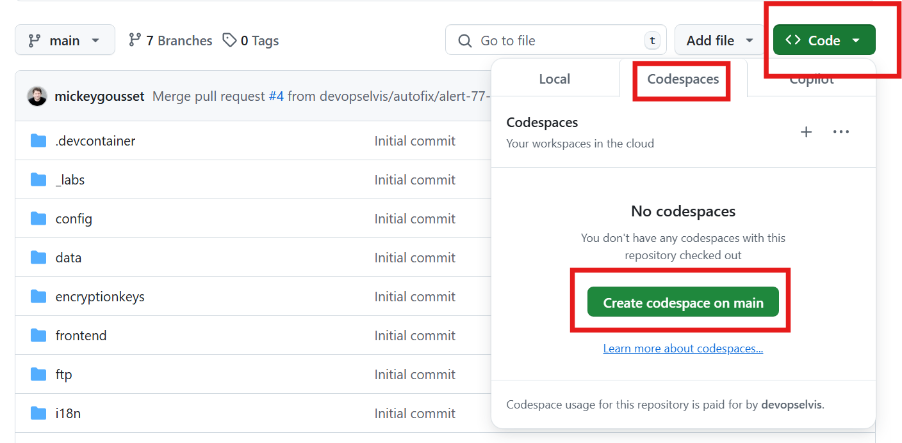
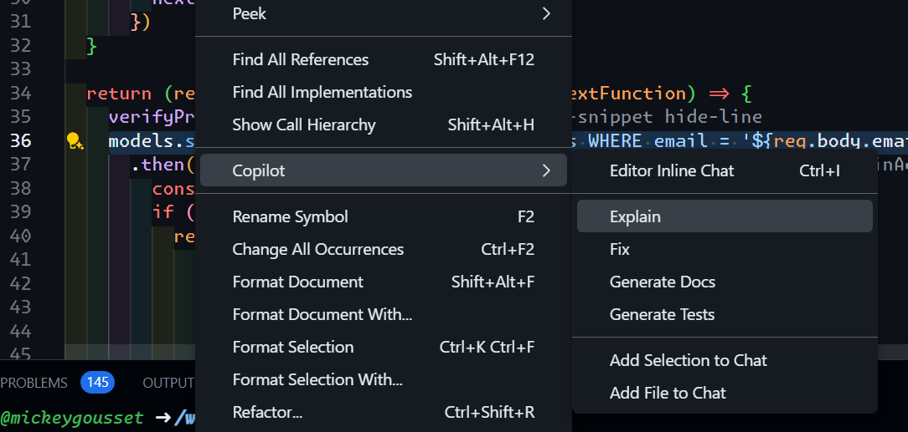
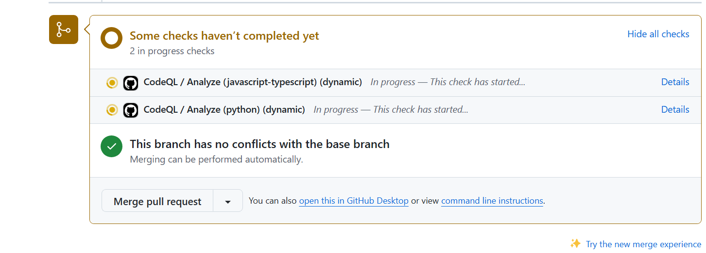
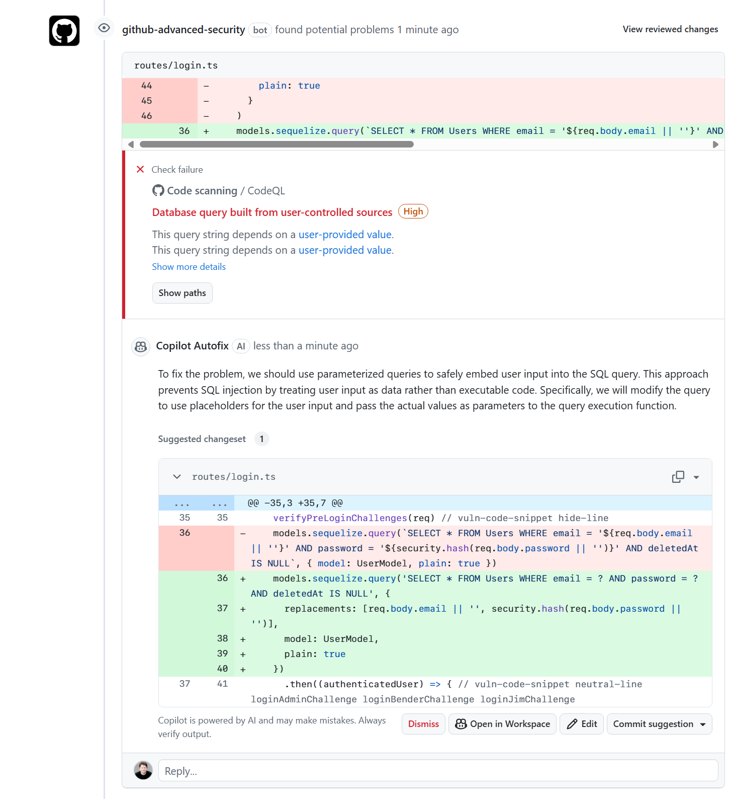
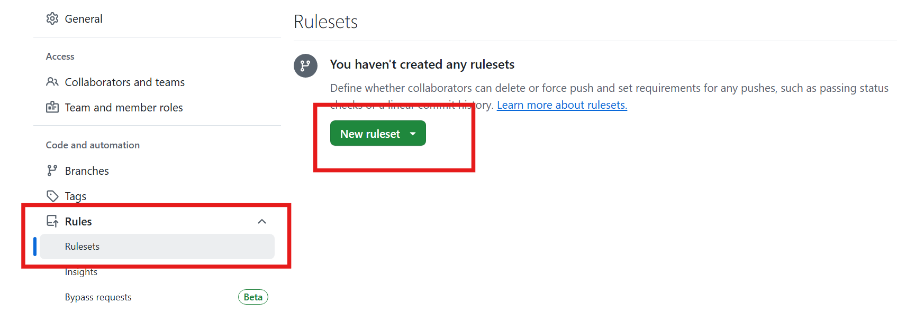
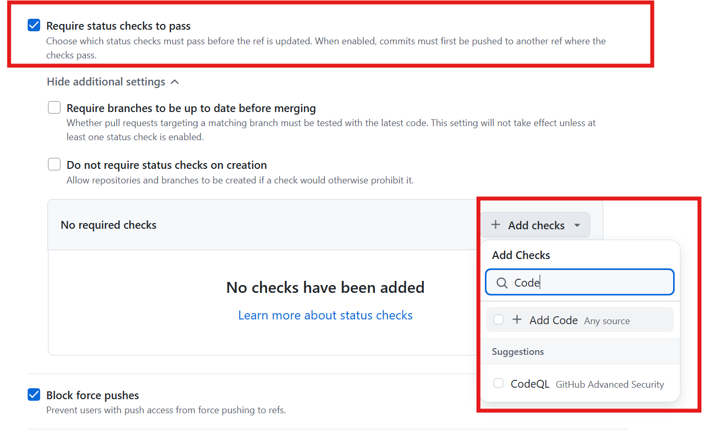
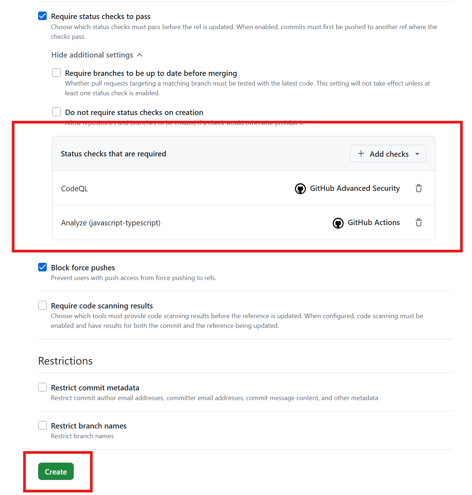

# Lab 3 - Hands-on with Code Scanning

With Code Scanning enabled, we want to block vulnerable code from entering the codebase. We can define a repository ruleset to enforce this. Also, let's see how Copilot Autofix can help fix security vulnerabilities for us.

This lab covers parts of the following exam domains:

- Domain 4: Configure and use code scanning
- Domain 5: Use code scanning with CodeQL
- Domain 6: Describe GitHub Advanced Security best practices

## Exercise 1: Introduce a code scanning security vulnerability

1. Let's open up the repository in Codespaces! Navigate to the **Code** tab in the repo and click on the green **Code ▾** button. Then, click on **Codespaces** tab and **Create codespace on main**.

<details>
  
</details>

2. Give it a few moments to load the repository. Codespaces allows you full access to a cloud compute environment to develop and debug your code. It's a great way to get started with a project quickly and to contribute to open source projects.
3. Now, Josh has given you a new piece of code to add to the `routes/login.ts` file.
4. Before making the code change, let's create a new branch. Click **main** in the taskbar at the bottom of VSCode (the **main** that appears just to the right of your Codespaces name).
5. Select **Create new branch**, enter **lab3/code-scanning-vulnerability**, and hit Enter. The branch will be created and VSCode will switch to the branch.
6. Open the **routes/login.ts** file.
7. Find lines 36-46 and delete them

```diff
- models.sequelize.query(
-       'SELECT * FROM Users WHERE email = :email AND password = :password AND deletedAt IS NULL',
-       {
-         replacements: {
-           email: req.body.email || '',
-           password: security.hash(req.body.password || '')
-         },
-         model: UserModel,
-         plain: true
-       }
-     )
```

8. At line 36, add the following code:

```javascript
models.sequelize.query(`SELECT * FROM Users WHERE email = '${req.body.email || ''}' AND password = '${security.hash(req.body.password || '')}' AND deletedAt IS NULL`, { model: UserModel, plain: true })
```

9. You know what? Maybe we should double-check this code from Josh. Highlight line 36. Let's ask Copilot Chat to explain this line of code. With line 36 highlighted, **right click** on the line and select **Copilot --> Explain**.

<details>
  
</details>

10. Copilot chat should open up and explain what this line is doing. And oh no, read it thoroughly - it tells us we have a vulnerability! 😱
11. We can ask Copilot chat how we could fix it. Better yet, do this: right click on line 36 and select **Copilot --> Fix**. ❗️❗️ We don't want to save anything though, so just review the fix for now. Don't accept this change, click on the **Discard** button.❗️❗️
12. Let's push our new branch with the vulnerability up to GitHub. Select the **Source Control** extension on the left side of Visual Studio Code
13. Click the **+** button next to **login.ts** to stage the changes
14. Add a commit message and click **Commit**.
15. Click **Publish Branch** to push your new branch with the code changes to GitHub.
16. Let's create a pull request for this branch to attempt to merge it into main.
    - In another browser tab, navigate back to the repository.
      - Alternatively navigate back to the [workshop organization](https://github.com/ghuwsec1953) and find your repo.
    - Click the **Pull requests** tab --> **New pull request** button --> select the `lab3/code-scanning-vulnerability` to merge into `main`.
    - Click **Create pull request**
    - In the pull request description, click the Copilot icon on the formatting bar and have Copilot generate a pull request **summary** for you.
    - Click **Create pull request**
17. After the pull request is created, the code scanning job will have been initiated. You can see the status of the job in the pull request checks. It will take a few minutes to run.

<details>
  
</details>

10. CodeQL should find the vulnerability, so the check will fail. Also, we should see Copilot create us an autofix on the PR that we can review.
11. It might take Copilot a few moments to create the autofix.
12. Review the autofix - we can prevent a vulnerability from entering the repository now with a click of a button! 🎉 ⚠️⚠️ **But don't commit the suggestion yet.** ⚠️⚠️

<details>
  
</details>

## Exercise 2: Creating a code scanning ruleset

Without a ruleset (GitHub's new version of branch protections), even though CodeQL found the vulnerability, a developer could still merge the code mistakenly, or merge the code before the CodeQL checks finish. Let's prevent this!

> [!NOTE]  
> We want to wait for the PR check to finish entirely (with a pass or fail) before creating the ruleset!

1. Let's go into the **Settings** tab of the repository (we will be adding a branch ruleset).
2. On the left hand list of options, click on **Rules --> Rulesets**.

<details>
  
</details>

3. Click on **New ruleset ▾ --> New branch ruleset**
4. Create the ruleset:
    1. Give the ruleset a **name** (any name is fine)
    2. Change the **enforcement status** to **Active**.
    3. Under **target branches**, click **Add target** and select **Include default branch**.
    4. Scroll down and check the **Require code scanning results** box
    5. The CodeQL tool should already be there - there's nothing to change
5. Scroll down and click the **Create** button.

<details>
  
</details>

7. With the ruleset created, both the JavaScript scan has to finish and no vulnerabilities found with CodeQL in order to merge the code.
8. Navigate back to our open PR. The **Merge pull request** button should now be grayed out, preventing us from merging vulnerable code.

<details>
  
</details>

9. Review the **Copilot Autofix suggestion** - it offers a similar suggestion to what Copilot in our IDE did!
10. Click on the **commit suggestion** button and **commit changes**.
11. After another CodeQL scan, the PR should pass and the **Merge pull request** button should be enabled, allowing you to merge the change without the vulnerability.
    - ➡️ For the purposes of this lab, you don't have to actually merge the PR, so **you don't have to wait fo the CodeQL scan to finish before moving on**.
12. Celebrate 🎉! We just prevented a security vulnerability from entering our codebase!

## Summary

Excellent!  In this lab you learned how to use Codespaces and Copilot to understand your code base, and even find errors in your code. We saw how GitHub code scanning can find bugs in the pull request and suggest solutions for them. And we learned how to use repository rulesets to block a pull request from merging until the checks are resolved.

In the next lab, we are going to learn about Dependency Review, and how it can help us stop bad dependencies from making it to the default branch.

➡️ Head back to the [labs](README.md) page to continue on to the next lab.
