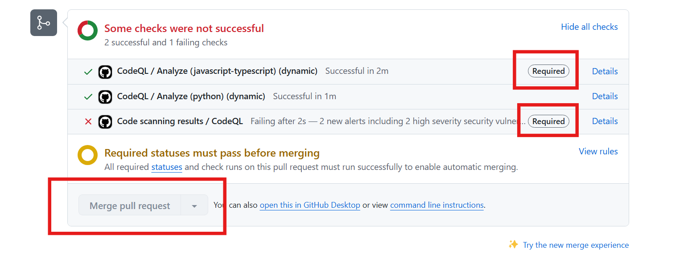

# Lab 3 - Hands-on with Code Scanning

With Code Scanning enabled, we want to block vulnerable code from entering the codebase. We can define a repository ruleset to enforce this. Also, let's see how Copilot Autofix can help fix security vulnerabilities for us.

This lab covers parts of the following exam domains:

Domain 4: Configure and use code scanning
Domain 5: Use code scanning with CodeQL
Domain 6: Describe GitHub Advanced Security best practices

## Exercise 1: Introduce a code scanning security vulnerability

1. Let's open up the repository in Codespaces! Navigate to the **Code** tab in the repo and click on the green **Code ▾** button. Then, click on **Codespaces** tab and **Create codespace on main**.

  

2. Give it a few moments to load the repository. Codespaces allows you full access to a cloud compute environment to develop and debug your code. It's a great way to get started with a project quickly and to contribute to open source projects.
3. Switch to the `lab3/code-scanning-vulnerability` branch. This branch has a commit with an intentional security vulnerability in it. To switch branches, you can:
    - In the lower left of the Codespace, click on `main` and pick the branch.
    - Otherwise, in a terminal (CTRL/CMD + `` ` `` ) and enter: `git checkout lab3/code-scanning-vulnerability`
4. Open the `routes/login.ts` file. This file has a security vulnerability in it.
5. Highlight line 36. Let's ask Copilot Chat to explain this line of code. With line 36 highlighted, **right click --> Copilot --> Explain**.

  

6. Copilot chat should open up and explain what this line is doing. And oh no, read it thoroughly - it tells us we have a vulnerability! 😱
7. We can ask Copilot chat how we could fix it. Better yet, do this: right click on line 36 and select **Copilot --> Fix**. ❗️❗️ We don't want to save anything though, so just review the fix for now. ❗️❗️
8. Let's create a pull request for this branch to attempt to merge it into main.
    - In another browser tab, navigate back to the repository --> **Pull requests** tab --> **New pull request** button --> select the `lab3/code-scanning-vulnerability` to merge into `main`.
9. After the pull request is created, the code scanning job will have been initiated. You can see the status of the job in the pull request checks. It will take a few minutes to run.

  

10. CodeQL should find the vulnerability, so the check will fail. Also, we should see Copilot create us an autofix on the PR that we can review.
11. It might take Copilot a few moments to create the autofix.
12. Review the autofix - we can prevent a vulnerability from entering the repository now with a click of a button! 🎉But don't commit the suggestion yet.

  

## Exercise 2: Creating a code scanning ruleset

Without a ruleset (GitHub's newer version of branch protections), even though CodeQL found the vulnerability, a developer could still merge the code mistakenly, or merge the code before the CodeQL checks finish. Let's prevent this!

> [!NOTE]  
> We have to wait for the PR check to finish entirely (with a pass or fail) in order to create the ruleset properly!

1. Let's go into the **Settings** tab of the repository (we will be adding a branch ruleset).
2. On the left hand list of options, click on **Rules --> Rulesets**.

  

3. Click on **New ruleset ▾ --> New branch ruleset**
4. Create the ruleset:
    1. Give the ruleset a **name** (any name is fine)
    2. Change the enforcement status to **Active**.
    3. Under **target branches**, click **Add target** and select **Include default branch**.
    4. Scroll down and check the **Require status checks to pass** box
    5. Click on the **+ Add checks ▾** button
    6. Search for **CodeQL**. We should see a suggested **CodeQL** check show up with **GitHub Advanced Security** text to the right. Add it.

  

    7. Let's also search for **Analyze**. We should see a **Analyze (javascript-typescript)** check show up. Add it.
    8. Scroll down and click the **Create** button.

  

5. With the ruleset created, both the JavaScript scan has to finish and no vulnerabilities found with CodeQL in order to merge the code.
6. Navigate back to our open PR. The **Merge pull request** button should now be grayed out, preventing us from merging vulnerable code.

  

7. Celebrate 🎉! We just prevented a security vulnerability from entering our codebase!

## Summary

Excellent!  In this lab you learned how to use Codespaces and Copilot to understand your code base, and even find errors in your code. We saw how GitHub code scanning can find bugs in the pull request and suggest solutions for them. And we learned how to use repository rulesets to block a pull request from merging until the checks are resolved.

In the next lab, we are going to learn about Dependency Review, and how it can help us stop bad dependencies from making it to the default branch.
