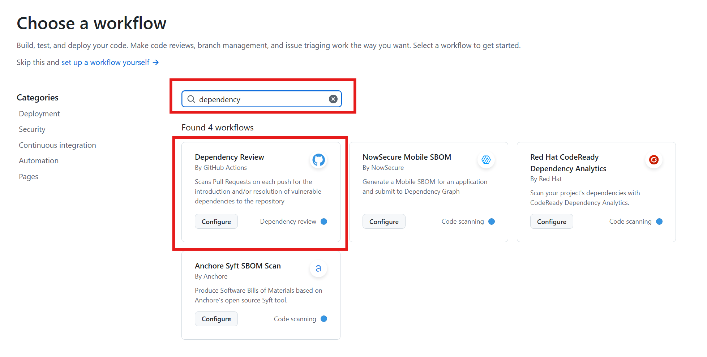
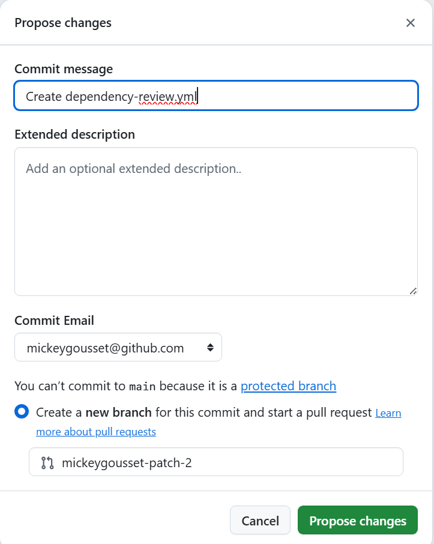
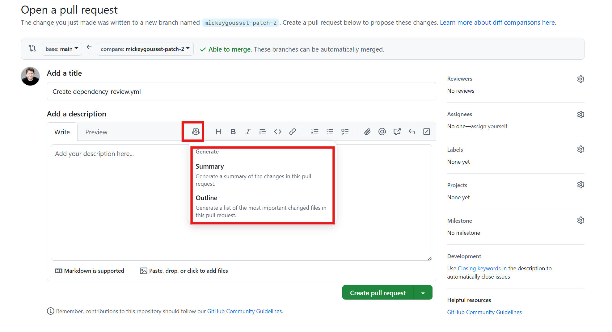
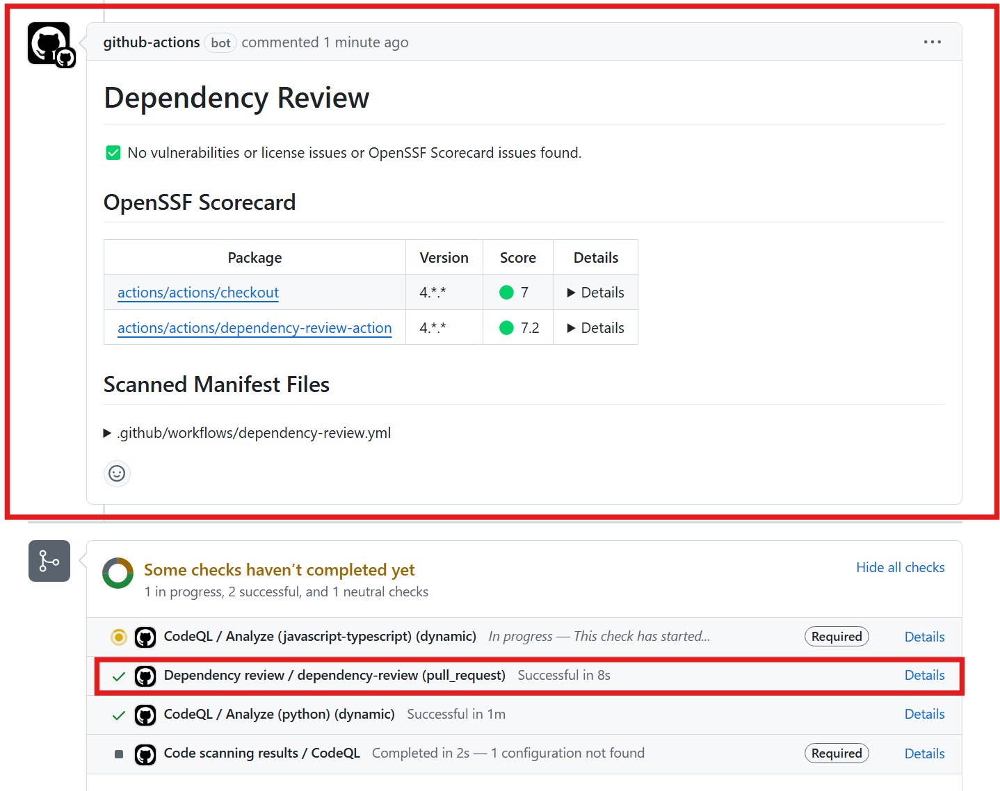
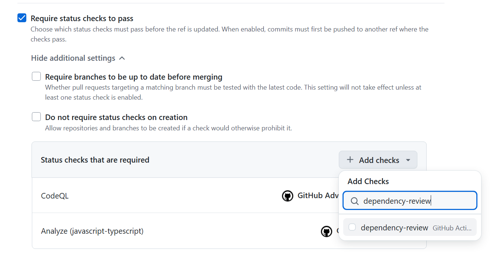
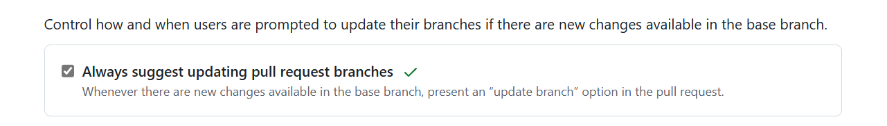
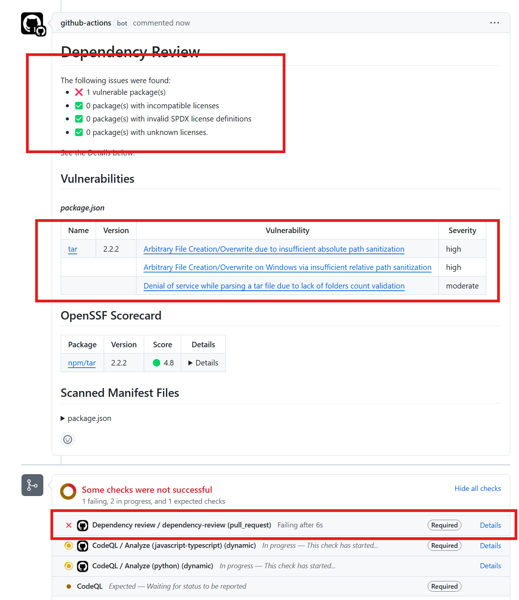

# Lab 4 - Hands-on with Dependency Review

With Dependency Review enabled and configured, we want to block vulnerable packages from entering the codebase. We can define a repository ruleset to enforce this as well!

## Exercise 1: Add the Dependency Review Action

First, let's add the dependency review action workflow.

1. In the repository, click on the **Actions** tab.
2. Click on the **New workflow** button in the upper left.
3. Search for "**dependency**" and click enter on your keyboard.
4. Under the **Dependency Review** workflow, click **Configure**.

  

5. Review the action and its defaults on line 32-39. This action can also block specific open source license types.
6. In the upper right, click on **Commit changes...**
7. Since we have a ruleset, we have to create a branch and merge this to main via pull request. Create a branch and commit (**propose**) the changes.

  

8. On the next screen, use the Copilot icon to generate a pull request description. Use either outline or summary.

  

9. Click **Create pull request**.
10. Wait for the code scanning job to finish. It will take a few minutes to run.
  
  - You will notice that the Dependency Review workflow ran against this PR and found nothing wrong.

  

11. Merge the PR once the code scanning completes.
12. Navigate to **Settings** of the repo.
13. Navigate to **Rules --> Rulesets** again to modify the existing ruleset you created in lab 3.
14. Under the **Require status checks to pass**, click on the **Show additional settings** button.
15. Click on **Add checks**.
16. Search for `dependency-review` and add it (it should show up under **suggestions**).

  

17. Save the ruleset.

## Exercise 2: Introduce a dependency vulnerability

Now, let's attempt to add a vulnerable dependency to the codebase and test out the dependency review feature.

1. In the repository, navigate to the **Settings** page.
2. ❗️ Scroll down to under the **Pull requests** settings section and check the box for **Always suggest updating pull request branches**. ❗️

  

3. Navigate back to the **Code** tab in the repo.
4. Switch to the `lab4/dependency-vulnerability` branch.
    - You can change to this branch by selecting the **main** dropdown below the repository name when under the **Code** tab.
5. Open up the `package.json` file in the repository root.
6. Navigate to line 182 and review this line - this branch has a change to introduce the `"tar": "2.2.2"` package to the codebase - a package with a known vulnerability.

  

7. Create a pull request by navigating the the **Pull requests** tab and clicking on the **New pull request** button.
8. Make sure to select the `lab4/dependency-vulnerability` branch to merge into the `main` branch. Also make sure to use Copilot to generate a PR summary for you
   If you scroll down to the status check section of the PR, you should see a note: "This branch is out-of-date with the base branch".
10. Click on the **Update branch** button; this adds in the dependency review workflow you committed in the prior exercise. TODO: verify this works correctly
11. Wait for the dependency review job to finish.
12. It should make a comment to the pull request with a note that it found a vulnerable package dependency. In fact, adding this one vulnerable package would introduce 3 new vulnerabilities to our codebase.

  

13. Also, the status check will be marked as failed, preventing the pull request from being merged.

## Summary

Celebrate 🎉! We just prevented a security vulnerability from entering our codebase! Without dependency review, if a pull request from this branch was opened to main, nothing would prevent the vulnerability from being introduced.

In the next lab, we are going to go hands-on with secret scanning, and see how we can use push protection to stop secrets from being pushed to GitHub.
