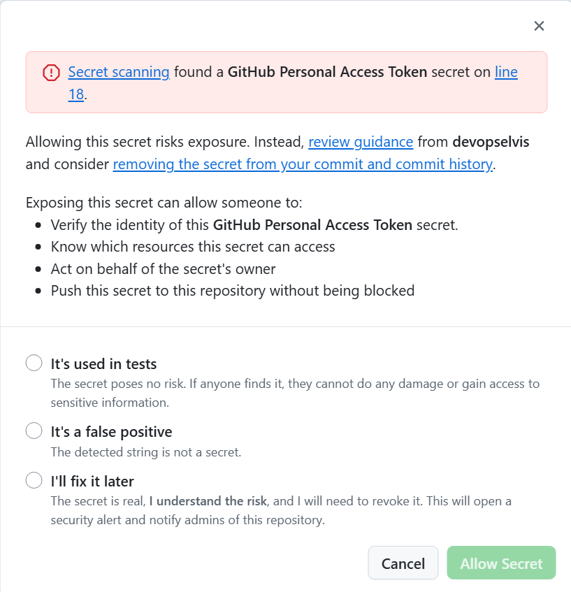
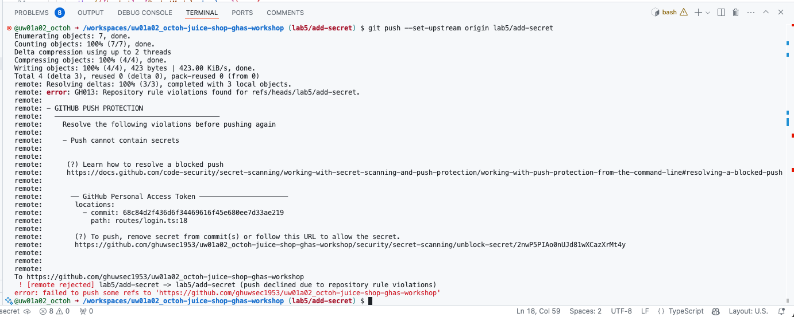

# Lab 5 - Hands-on with Secret Scanning

Let's use Secret Scanning with push protections to prevent secrets from entering the codebase!

This lab covers parts of the following exam domains:

- Domain 2: Configure and use secret scanning
- Domain 6: Describe GitHub Advanced Security best practices

## Exercise 1: Attempt to commit a secret

1. Let's try to commit a secret to the repository to test out the secret scanning push protection feature.
2. But first, we need a secret to commit! The easiest is to generate a GitHub personal access token (with limited scopes) and attempt to commit it.
3. In a new browser tab, navigate to github.com and click on your **user profile picture** in the upper right and click on **Settings**.
4. In the lower left of the list of options, click on **Developer settings**.
5. Click on **Personal Access Tokens** to expand and click on **Tokens (classic)**.
6. Generate a **new token** (**classic**).
7. We don't need to give the token any scopes here - just give it a **name** and scroll down to the bottom and **Generate**.
8. **Copy**  the value of the token to the clipboard.
    - Note: If you leave this page, you will not be able to copy the token again. If you lose the token from the clipboard, either regenerate the token or create a new one.
9. Now, let's attempt to commit the token to the repository. You can do this in Codespaces or in the web browser.
10. Any file would work, but for example, we can open up the `routes/login.ts` file we edited earlier.
11. As an example, on line 18 you can add `const secret = "<YOUR TOKEN>";`, replacing `<YOUR TOKEN>` with the token you just generated - it should start with `ghp_`.
12. Save and commit the file.
    - If making the changes in the UI, the push will happen as you commit.
    - If making the change in Codespaces, you will have to push separately to a non-main branch.
13. Push protection should detect the GitHub personal access token and block the push - great!
    1. If using the browser, you will see a message with a red banner that the push was blocked.
    2. If using Codespaces review the git output in the terminal. It should provide information on why the push was blocked (because of the secret scanning push protection).
    3. As a GitHub organization owner, you can add in a link that appears in the terminal output that links to a GitHub wiki, readme, etc. that explains to the developer on how to resolve the issue. For example, you can instruct the developer to run a `git reset HEAD~1`, where `1` is the number of commits they need to rewind in order to remove the commit with the secret.

  In the UI:   
  In an IDE/Codespaces: 

14. Depending on how the settings are configured, we could bypass the push protection and push the secret to the repository. But, we don't want to do that! 🙅‍♂️ Repository admins and organization owners would receive an email notification if we did.
15. BONUS: If you used the browser to commit a secret, switch to Codespaces and try to commit and push the secret. If you used Codespaces, try using the browser to commit and push the secret. See how the experience differs, but the end result is still the same: no secrets committed to the repository!
16. BONUS BONUS: Ok, go ahead and push the secret anyway and see what happens. Did you get a secret scanning alert? If so, does the alert say the secret is valid?

## Summary

Celebrate 🎉! We just prevented a secret from entering our codebase!

And there you have it. You should now have a good grasp on what GitHub Advanced Security is, how it works, and how to implement it. So get out there and keep your company secured!

➡️ Head back to the [labs](README.md) page to continue on to the next lab.
